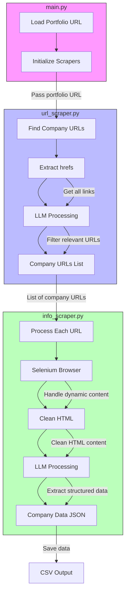

# Company Crawler

 Python-based web scraping tool designed to extract company information from portfolio websites.

## Usage

### Virtual Environment Setup

Install Python 3.9 or higher 

Create a virtual environment:

```
python3 -m venv env
```

Activate the virtual environment:

```
source env/bin/activate
```

### Running the Scraper

Clone the repository:

```
git clone https://github.com/aphdinh/smart-crawler.git
```

Install the required dependencies:

```
pip install -r requirements.txt
```

Run the main script to scrape a portfolio page:

```
python main.py --portfolio-url https://www.nvfund.com/portfolio/ --output companies.csv
```

The --portfolio-url argument specifies the URL of the portfolio page to scrape.
The --output argument sets the filename for the CSV output.

## File Structure

```
company-crawler/
├── src/
│   ├── __init__.py
│   ├── info_scraper.py         # Handles the scraping of company information
│   ├── models.py               # Defines the Company data model
│   ├── url_scraper.py          # Handles the scraping of portfolio page URLs
│   └── utils.py                # Includes utility functions
├── scrape_single.py            # Script for scraping a single company URL
├── main.py                     # Main entry point for scraping a portfolio page
├── .gitignore
├── companies.csv               # Sample CSV output file
└── README.md
```


